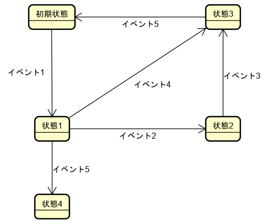

# nswitchcov_a　ユーザマニュアル

このドキュメントではnswitchcov_aの使用方法を解説します。

## nswitchcov_aについて

nswitchcov_aは状態遷移テストにおけるNスイッチカバレッジを計測するツールです。

## ダウンロード

https://github.com/hiro-iseri/nswitchcov_a/releases

## 使い方

【実行方法】CUI環境で以下を引数指定して実行します。

* --stateflow ファイルパス ：状態遷移定義ファイルのパス
* --exepath ファイルパス　：実行フローファイルのパス
* --n 正の整数　：NスイッチのN値
* --charcode 文字列 :入力ファイルの全角文字コード(オプション)。未指定の場合OSのデフォルト文字コードが設定される

【実行結果】Nスイッチカバレッジを表示します。

#### 実行コマンドの例

```
nswitchcov_a --exepath=exepath.txt --stateflow=stateflow.txt --n 0
```

#### 出力結果の例

```
number of execution path:2
number of n-switch path:4
n-switch coverage:50.00%(2/4)
```

## 入力ファイルの書き方

nswitchcov_aは次の2つのファイルを入力として要求します。

* 状態遷移定義ファイル：状態遷移の定義を記述する
* 実行フローファイル：実行時に網羅する状態遷移を記述する


### 共通ルール

* 「#」から始まる行、空行は無視されます
* 状態、イベントのキーワード前後のタブやスペースは除去されます

状態遷移は「-」「>」を使って、次のパターンを連ねて記述します

```
遷移元状態 - 遷移イベント > 遷移先状態
```

複数の状態遷移をつなげて記載したり、複数行に分けて記載することが可能です。

つなげて記載する場合：

```
状態1 - 遷移イベント1 > 状態2 - 遷移イベント2 > 状態3
```

複数行に分けて記載する場合：

```
状態1 - 遷移イベント1 > 状態2
状態2 - 遷移イベント2 > 状態3
```

### 状態遷移定義ファイルの記載ルール

* 共通ルールに従って記載します。
* 全行の記述を1つの状態遷移の定義として扱います。遷移の定義の重複は無視されます。

### 実行フローファイルの記載ルール

* 共通ルールに従って記載します。
* 1回の実行でたどる状態遷移を1行にまとめて記載していきます。

### 入力ファイルの全角文字コードの指定

charcodeオプションを使って、全角文字コードを指定できます。
指定可能な文字コードは「"shiftjis"」「"utf8"」「"euc"」です。
オプションが指定されていない場合は、OSの標準文字コードが選択されます。

WindowsでUTF-8で書かれた入力ファイルを使用する場合：

```
nswitchcov_a.exe --exepath=exe.txt --stateflow=input.txt --n 2 --charcode=utf8
```


## 実例

### 対象

以下の状態遷移を対象として2スイッチカバレッジを計測します。



テストケースでは以下を実行します。

* テストケース1 :初期状態→状態1→状態4
* テストケース2 :初期状態→状態1→状態2→状態3→初期状態
* テストケース3 :初期状態→状態1→状態3

### 作成する入力ファイル

以下のファイルを作成します。

状態遷移定義ファイルの例(stateflow.txt)：

```
初期状態 - イベント1 > 状態1
状態1 - イベント2 > 状態2
状態1 - イベント4 > 状態3
状態1 - イベント5 > 状態4
状態2 - イベント3 > 状態3
状態3 - イベント5 > 初期状態
```

実行フローファイルの例(exepath.txt)：

```
#テストケース1
初期状態 - イベント1 > 状態1 - イベント5 > 状態4
#テストケース2
初期状態 - イベント1 > 状態1 - イベント2 > 状態2 - イベント3 > 状態3 - イベント5 > 初期状態
#テストケース3
初期状態 - イベント1 > 状態1 - イベント4 > 状態3
```

### 実行するコマンド

以下を実行します。

```
nswitchcov_a.exe --exepath=exepath.txt --stateflow=stateflow.txt --n 2
```

以下のような結果が表示されます。

```
nswitchcov_a(ver:1.01)
number of execution path:3
number of n-switch path:8
n-switch coverage:25.00%(2/8)
```
